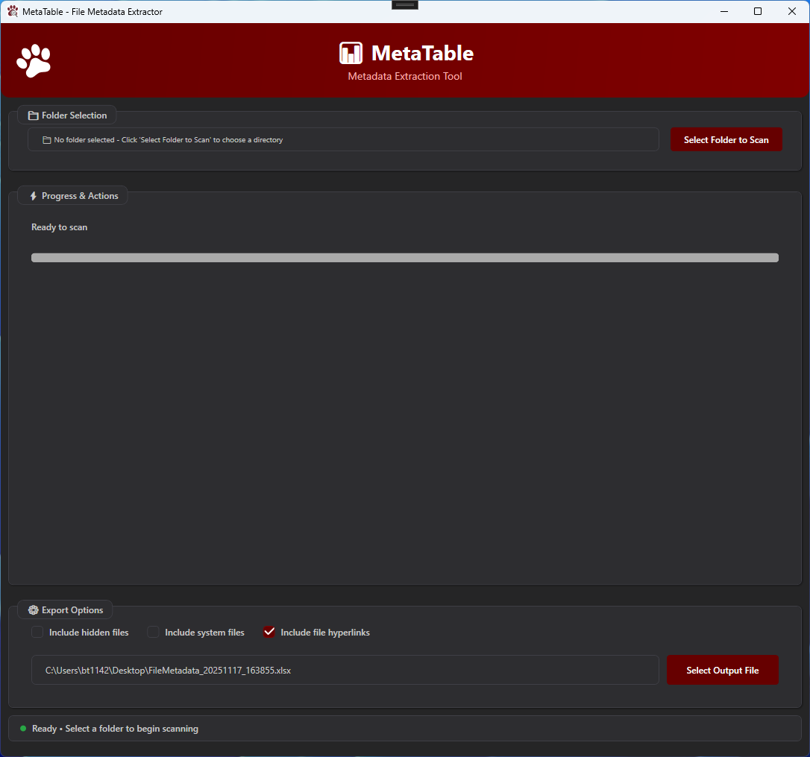

# MetaTable

A modern WPF desktop application for Windows that scans files in a directory and exports comprehensive metadata to Excel.



## Features

- 🔍 **Recursive File Scanning** - Scans all files in selected folder and subfolders
- 📊 **Excel Export** - Exports detailed metadata to `.xlsx` format
- 🎨 **Modern UI** - Clean, user-friendly interface with smooth animations
- ⚡ **Real-time Progress** - Live progress tracking during file scanning
- 🛑 **Cancellable Operations** - Stop scanning at any time
- 📁 **Smart File Management** - Automatically opens output location after export

## Metadata Captured

MetaTable extracts the following information for each file:

- File name and extension
- Full file path
- File size
- Creation date and time
- Last modified date and time
- Last accessed date and time
- File attributes (Read-only, Hidden, System, Archive)

## System Requirements

- Windows 10/11
- .NET 9.0 Runtime (or use the self-contained executable)

## Usage

1. **Select Folder** - Click "📁 Select Folder to Scan" to choose the directory
2. **Choose Output** - Click "📄 Select Output Excel File" to specify where to save results
3. **Scan** - Click "🔍 Scan Files and Export Data to Excel" to start scanning
4. **View Results** - The Excel file will open automatically when complete

### Tips

- Double-click the folder path to open the folder in Explorer
- Double-click the output path to open the Excel file location
- Click the scan button during operation to cancel the scan
- Hover over any control to see helpful tooltips

## Building from Source

```powershell
# Clone the repository
git clone https://github.com/bt1142msstate/MetaTable.git
cd MetaTable

# Build the project
dotnet build

# Run the application
dotnet run --project MetaTable/MetaTable.csproj
```

### Publishing a Release Build

```powershell
# Create a self-contained, single-file executable
dotnet publish MetaTable/MetaTable.csproj -c Release -r win-x64 --self-contained true -p:PublishSingleFile=true -p:IncludeNativeLibrariesForSelfExtract=true -o publish
```

## Technology Stack

- **Framework**: .NET 9.0
- **UI**: WPF (Windows Presentation Foundation)
- **Excel Export**: EPPlus
- **Language**: C#

## License

This project is open source and available under the [MIT License](LICENSE).

## Author

Created by Brandon Temple

## Contributing

Contributions, issues, and feature requests are welcome! Feel free to check the issues page.
